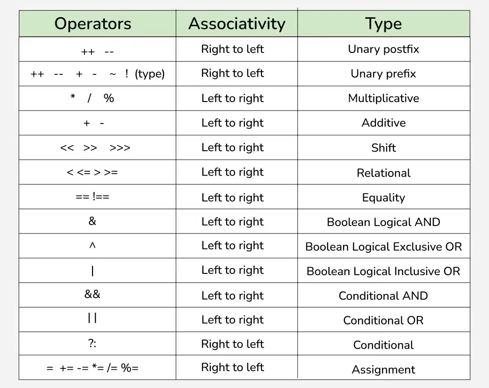
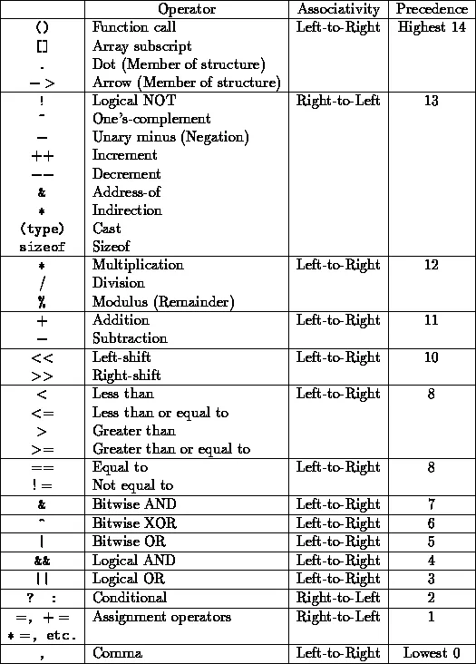

# Operators
- Operators are special symbols that perform specific operations on one, two, or three operands, and then return a result.

## Types of Operators
1. Arithmetic Operators
2. Relational Operators
3. Logical Operators
4. Bitwise Operators
5. Assignment Operators
6. Unary Operators
7. Ternary Operators
8. Shift Operators
9. Instanceof Operator

## Arithmetic Operators
- Arithmetic operators are used to perform arithmetic operations on variables and values.
Example:
    - `+` (Addition)
    - `-` (Subtraction)
    - `*` (Multiplication)
    - `/` (Division)
    - `%` (Modulus)

## Relational Operators
- Relational operators are used to check the relationship between two operands.
Example:
    - `==` (Equal to)
    - `!=` (Not equal to)
    - `>` (Greater than)
    - `<` (Less than)
    - `>=` (Greater than or equal to)
    - `<=` (Less than or equal to)

## Logical Operators
- Logical operators are used to determine the logic between variables or values.
Example:
    - `&&` (Logical and)
    - `||` (Logical or)
    - `!` (Logical not)

## Bitwise Operators
- Bitwise operators are used to perform bitwise operations on variables.
Example:
    - `&` (Bitwise and)
    - `|` (Bitwise or)
    - `^` (Bitwise XOR)
    - `~` (Bitwise complement)
    - `<<` (Left shift)
    - `>>` (Right shift)
    - `>>>` (Unsigned right shift)

## Assignment Operators
- Assignment operators are used to assign values to variables.
Example:
    - `=` (Assign)
    - `+=` (Add and assign)
    - `-=` (Subtract and assign)
    - `*=` (Multiply and assign)
    - `/=` (Divide and assign)
    - `%=` (Modulus and assign)
    - `<<=` (Left shift and assign)
    - `>>=` (Right shift and assign)
    - `&=` (Bitwise and and assign)
    - `^=` (Bitwise XOR and assign)
    - `|=` (Bitwise or and assign)

## Unary Operators
- Unary operators are used to perform operations on a single operand.
Example:
    - `+` (Unary plus)
    - `-` (Unary minus)
    - `++` (Increment)
    - `--` (Decrement)
    - `!` (Logical not)
    - `~` (Bitwise complement)

## Ternary Operator
- The ternary operator is a conditional operator that evaluates a boolean expression and returns one of the two expressions based on the result of the evaluation.
Example:
    - `condition ? expression1 : expression2`

## Shift Operators
- Shift operators are used to shift the bits of a number left or right, thereby multiplying or dividing the number by two, respectively.
Example:
    - `<<` (Left shift) - Shifts bits left, filling 0s, with the rightmost bit depending on the sign.
    - `>>` (Right shift) - Shifts bits right, filling 0s (divides by a power of two), with the leftmost bit depending on the sign.
    - `>>>` (Unsigned right shift) - Shifts bits right, filling 0s, with the leftmost bit always being 0.

## Instanceof Operator
- The instanceof operator is used to test whether an object is an instance of a particular class or interface.
Example:
    - `object instanceof class`

## Operator Precedence
- Operator precedence determines the order in which operators are evaluated in an expression.
- Operators with higher precedence are evaluated first.
- The below table depicts the precedence of operators in decreasing order as magnitude, with the top representing the highest precedence and the bottom showing the lowest precedence.


## Associativity
- Associativity determines the order in which operators of the same precedence are evaluated.
- Operators with left-to-right associativity are evaluated from left to right.
- Operators with right-to-left associativity are evaluated from right to left.


## Interesting Facts

### 1. Token Generation in a Compiler
The compiler uses tools like `lex` to generate tokens. It matches the greatest possible match for token generation. This can lead to unexpected behavior if not understood properly.

#### Example: Token Matching in `a = b+++c;`

```java
public class GFG {
    public static void main(String[] args) {
        int a = 20, b = 10, c = 0;

        // a = b+++c is interpreted as:
        // b++ + c
        // Equivalent to: a = b + c; then b = b + 1
        a = b++ + c;

        System.out.println("Value of a(b+c), "
                           + " b(b+1), c = " + a + ", " + b
                           + ", " + c);

        // a = b+++++c is interpreted as:
        // b++ ++ + c
        // This results in a compilation error because
        // there is no operand after the second unary operator (++).

        // Uncommenting the line below would produce a compilation error:
        // a = b+++++c;
        // System.out.println(b+++++c);
    }
}
```

#### Output:
```
Value of a(b+c), b(b+1), c = 10, 11, 0
```

#### Explanation:
1. `a = b+++c;` is tokenized as `a`, `=`, `b`, `++`, `+`, `c`.
2. The result is `a = b + c;` followed by `b = b + 1`.
3. `a = b+++++c;` results in an error because it is tokenized as `a`, `=`, `b`, `++`, `++`, `+`, `c`, which is invalid.


### 2. Using `+` Operator Inside `System.out.println()`

When using the `+` operator, associativity is **left-to-right**. This can lead to unexpected results if parentheses are not used for addition.

#### Example: String Concatenation vs. Addition

```java
public class GFG {
    public static void main(String[] args) {
        int x = 5, y = 8;

        // Concatenation happens here:
        // First, "Concatenation (x+y) = " + x produces a string "Concatenation (x+y) = 5".
        // Then y (8) is concatenated to this string.
        System.out.println("Concatenation (x+y) = " + x + y);

        // Addition is performed here due to parentheses:
        // (x + y) = 5 + 8 = 13
        System.out.println("Addition (x+y) = " + (x + y));
    }
}
```

#### Output:
```
Concatenation (x+y) = 58
Addition (x+y) = 13
```

#### Explanation:
1. `"Concatenation (x+y) = " + x + y` treats `x` as part of the string due to left-to-right associativity.
2. To enforce addition before concatenation, use parentheses: `x + y` is calculated first.


### Key Takeaways
- Understand how tokens are generated by the compiler to avoid unexpected behavior.
- Use parentheses for addition in `System.out.println()` to ensure numeric addition happens before string concatenation.


